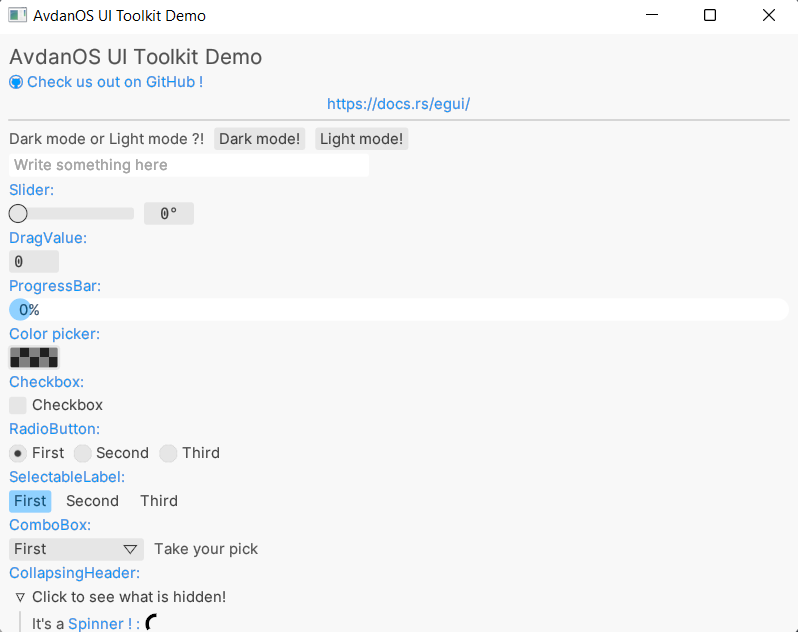
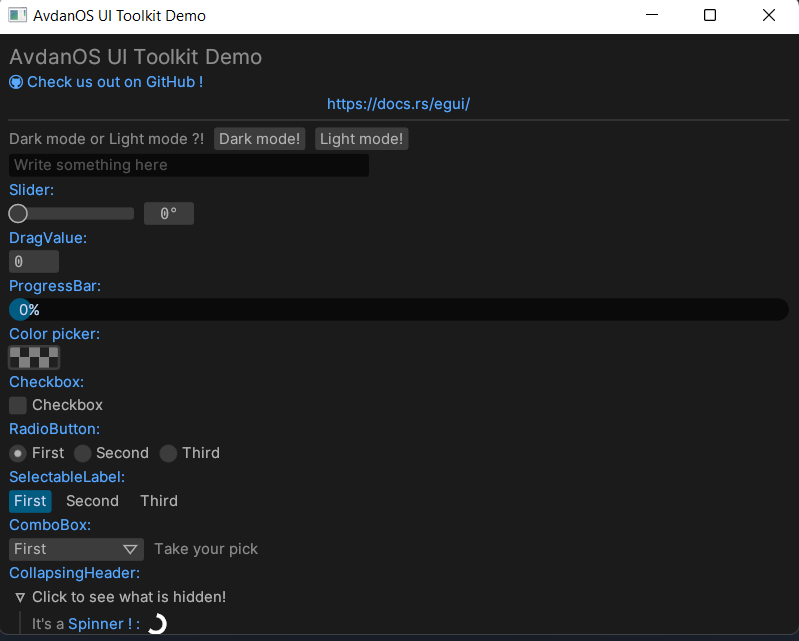

# UI-Toolkit

AvdanOS UI Toolkit made with Rust using the eGUI Library.
`https://github.com/emilk/egui`

The eGUI Widgets that have been shown in this little demo are :

- Labels
- Buttons
- Separators
- End_rows
- TextEdit boxes
- Sliders
- Drag values
- Progress bars
- ColorPickers
- Checkboxes
- Radio buttons
- Selectable Labels
- ComboBoxes
- Collapsing Headers + a Spinner

There are also many synced values and widgets. Using the "scalar" value, the Slider, DragValue, and the ProgressBar are synced (they have the same value across the different widgets). Similarly, using the "radio" value, the CheckBox, the SelectableLabel, and the RadioButtons are also synced.

## Screenshots

### Light Mode



### Dark mode



## How to use this

### Step 1: Setup

On debian-based linux distros run this command on the terminal:

```sudo apt-get install -y libclang-dev libgtk-3-dev libxcb-render0-dev libxcb-shape0-dev libxcb-xfixes0-dev libspeechd-dev libxkbcommon-dev libssl-dev```

On Fedora-based distros, you need to run this command:

```sudo dnf install clang clang-devel clang-tools-extra speech-dispatcher-devel libxkbcommon-devel pkg-config openssl-devel libxcb-devel```

Meanwhile on Arch-based distros, you run this command:

```sudo pacman -S install clang clang-tools-extra speech-dispatcher libxkbcommon pkg-config openssl libxcb```

### Step 2: Building and running

1. Clone this repository : (`git clone https://github.com/Avdan-OS/UI-Toolkit.git`)

2. Build the cloned repo : (`cd UI-Toolkit && cargo run`)

3. Yay! You're done!

### Useful Resources

Explore the different eGUI Widgets : `https://www.egui.rs/index.html#demo`
